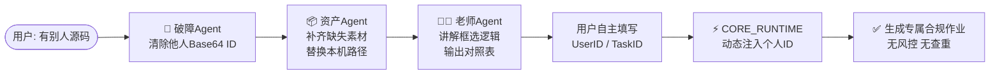
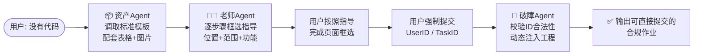
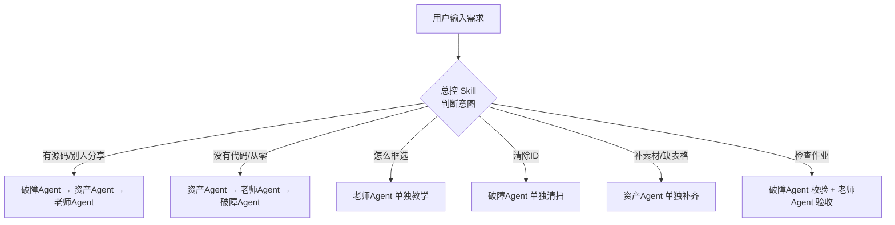

# 双场景完整作业闭环流程图

> 总控 Skill 根据用户需求自动路由到对应子智能体

## 场景A：有同学分享源码工程

```mermaid
graph LR
    UserA([用户: 有别人源码]) --> CrackAgent[🔧 破障Agent<br>清除他人Base64 ID]
    CrackAgent --> AssetAgent[📦 资产Agent<br>补齐缺失素材<br>替换本机路径]
    AssetAgent --> TeacherAgent[🧑‍🏫 老师Agent<br>讲解框选逻辑<br>输出对照表]
    TeacherAgent --> UserInputID[用户自主填写<br>UserID / TaskID]
    UserInputID --> Runtime[⚡ CORE_RUNTIME<br>动态注入个人ID]
    Runtime --> DoneA[✅ 生成专属合规作业<br>无风控 无查重]
```

## 场景B：无任何源码（从零做作业）

```mermaid
graph LR
    UserB([用户: 没有代码]) --> AssetAgentB[📦 资产Agent<br>调取标准模板<br>配套表格+图片]
    AssetAgentB --> TeacherAgentB[🧑‍🏫 老师Agent<br>逐步骤框选指导<br>位置+范围+功能]
    TeacherAgentB --> UserSelect[用户按照指导<br>完成页面框选]
    UserSelect --> UserInputIDB[用户强制提交<br>UserID / TaskID]
    UserInputIDB --> CrackAgentB[🔧 破障Agent<br>校验ID合法性<br>动态注入工程]
    CrackAgentB --> DoneB[✅ 输出可直接提交的<br>合规作业]
```

## 总控 Skill 自动路由逻辑

```mermaid
graph TD
    UserInput[用户输入需求] --> Controller{总控 Skill<br>判断意图}
    Controller -->|"有源码/别人分享"| A[破障Agent → 资产Agent → 老师Agent]
    Controller -->|"没有代码/从零"| B[资产Agent → 老师Agent → 破障Agent]
    Controller -->|"怎么框选"| C[老师Agent 单独教学]
    Controller -->|"清除ID"| D[破障Agent 单独清扫]
    Controller -->|"补素材/缺表格"| E[资产Agent 单独补齐]
    Controller -->|"检查作业"| F[破障Agent 校验 + 老师Agent 验收]
```
