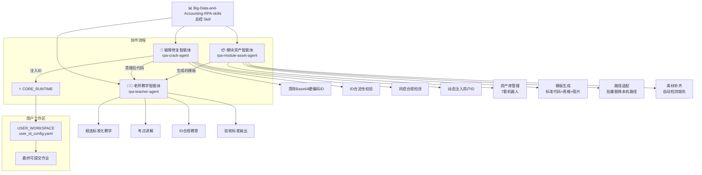
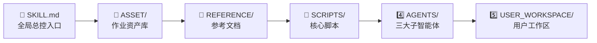

# 三大智能体协作架构图

> 总控 Skill 统一调度，三大子智能体各司其职

```mermaid
graph TB
    MainSkill[📊 Big-Data-and-Accounting-RPA-skills<br>总控 Skill] --> Teacher[🧑‍🏫 老师教学智能体<br>rpa-teacher-agent]
    MainSkill --> Crack[🔧 破障修复智能体<br>rpa-crack-agent]
    MainSkill --> Asset[📦 模块资产智能体<br>rpa-module-asset-agent]

    Teacher --> Teach1[框选标准化教学]
    Teacher --> Teach2[考点讲解]
    Teacher --> Teach3[ID合规教育]
    Teacher --> Teach4[验收标准输出]

    Crack --> Crack1[清除Base64硬编码ID]
    Crack --> Crack2[ID合法性校验]
    Crack --> Crack3[风控合规检测]
    Crack --> Crack4[动态注入用户ID]

    Asset --> Asset1[资产库管理<br>7套机器人]
    Asset --> Asset2[模板生成<br>标准代码+表格+图片]
    Asset --> Asset3[路径适配<br>批量替换本机路径]
    Asset --> Asset4[素材补齐<br>自动检测缺失]

    subgraph 协作流程
        Crack -->|清理后代码| Teacher
        Asset -->|生成的模板| Teacher
        Crack -->|注入ID| Runtime[⚡ CORE_RUNTIME]
    end

    subgraph 用户工作区
        Runtime --> UserWS[USER_WORKSPACE<br>user_id_config.yaml]
        UserWS --> Homework[最终可提交作业]
    end
```

## 系统层级架构

```mermaid
graph LR
    L1[🥇 SKILL.md<br>全局总控入口] --> L2[🥇 ASSET/<br>作业资产库]
    L2 --> L3[🥈 REFERENCE/<br>参考文档]
    L3 --> L4[🥉 SCRIPTS/<br>核心脚本]
    L4 --> L5[4️⃣ AGENTS/<br>三大子智能体]
    L5 --> L6[5️⃣ USER_WORKSPACE/<br>用户工作区]
```
