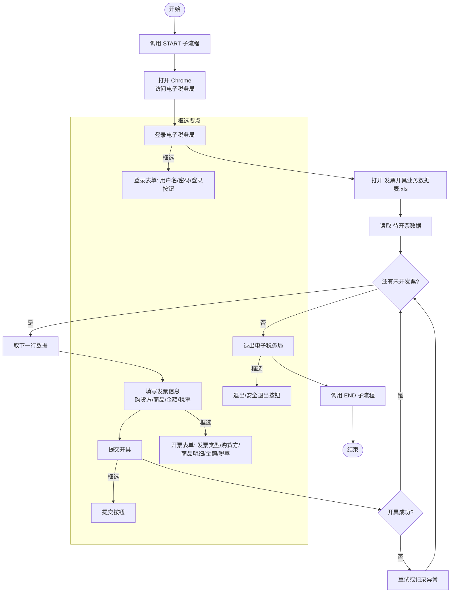

# 发票开具机器人 - 作业流程图

> 业务流程：启动 → 登录 → 读取数据 → 逐笔开票 → 退出

```mermaid
graph TD
    Start([开始]) --> CallStart[调用 START 子流程]
    CallStart --> OpenBrowser[打开 Chrome<br>访问电子税务局]
    OpenBrowser --> TaxLogin[登录电子税务局]
    TaxLogin --> OpenExcel[打开 发票开具业务数据表.xls]
    OpenExcel --> ReadData[读取 待开票数据]
    ReadData --> LoopData{还有未开发票?}

    LoopData -->|是| GetNext[取下一行数据]
    GetNext --> FillInvoice[填写发票信息<br>购货方/商品/金额/税率]
    FillInvoice --> SubmitInvoice[提交开具]
    SubmitInvoice --> CheckResult{开具成功?}
    CheckResult -->|是| LoopData
    CheckResult -->|否| Retry[重试或记录异常]
    Retry --> LoopData

    LoopData -->|否| Logout[退出电子税务局]
    Logout --> CallEnd[调用 END 子流程]
    CallEnd --> End([结束])

    subgraph 框选要点
        TaxLogin -->|框选| LoginArea[登录表单: 用户名/密码/登录按钮]
        FillInvoice -->|框选| InvoiceForm[开票表单: 发票类型/购货方/商品明细/金额/税率]
        SubmitInvoice -->|框选| SubmitBtn[提交按钮]
        Logout -->|框选| LogoutBtn[退出/安全退出按钮]
    end
```
