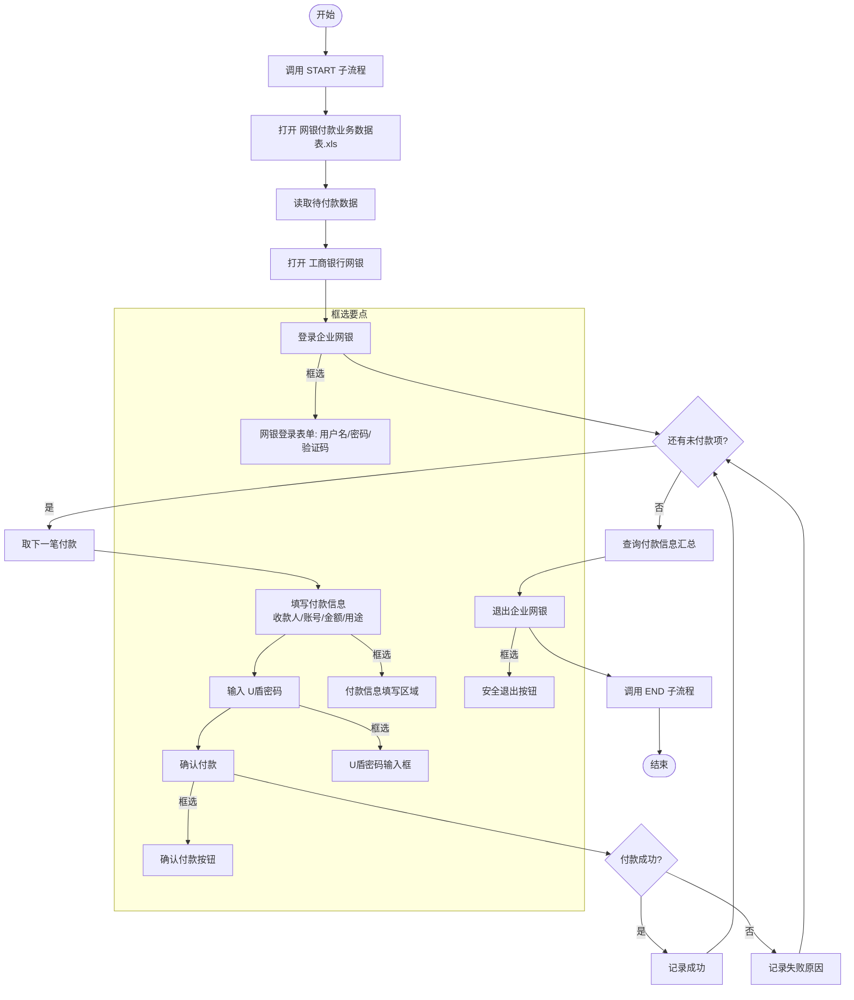

# 网银付款机器人 - 作业流程图

> 业务流程：启动 → 登录网银 → 读取付款表 → 逐笔付款 → 查询 → 退出

```mermaid
graph TD
    Start([开始]) --> CallStart[调用 START 子流程]
    CallStart --> OpenExcel[打开 网银付款业务数据表.xls]
    OpenExcel --> ReadData[读取待付款数据]
    ReadData --> OpenBank[打开 工商银行网银]
    OpenBank --> LoginBank[登录企业网银]
    LoginBank --> LoopData{还有未付款项?}

    LoopData -->|是| GetNext[取下一笔付款]
    GetNext --> InputPayInfo[填写付款信息<br>收款人/账号/金额/用途]
    InputPayInfo --> InputBankKey[输入 U盾密码]
    InputBankKey --> ConfirmPay[确认付款]
    ConfirmPay --> CheckPayResult{付款成功?}
    CheckPayResult -->|是| RecordSuccess[记录成功]
    CheckPayResult -->|否| RecordFail[记录失败原因]
    RecordSuccess --> LoopData
    RecordFail --> LoopData

    LoopData -->|否| QueryPayInfo[查询付款信息汇总]
    QueryPayInfo --> LogoutBank[退出企业网银]
    LogoutBank --> CallEnd[调用 END 子流程]
    CallEnd --> End([结束])

    subgraph 框选要点
        LoginBank -->|框选| BankLoginForm[网银登录表单: 用户名/密码/验证码]
        InputPayInfo -->|框选| PayForm[付款信息填写区域]
        InputBankKey -->|框选| BankKeyField[U盾密码输入框]
        ConfirmPay -->|框选| ConfirmBtn[确认付款按钮]
        LogoutBank -->|框选| LogoutBtn[安全退出按钮]
    end
```
