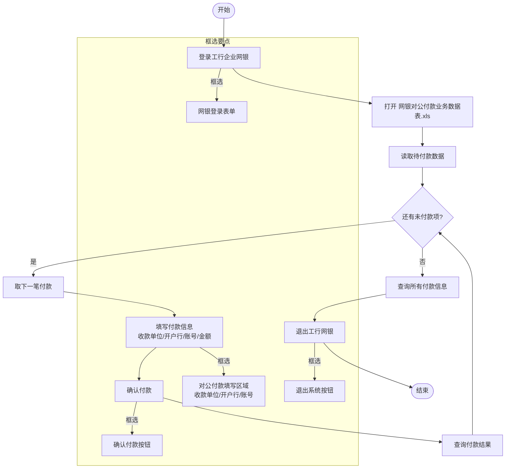

# 网银对公付款机器人（开发模板）- 作业流程图

> 业务流程：启动 → 登录网银 → 读取对公付款表 → 逐笔付款 → 查询 → 退出

```mermaid
graph TD
    Start([开始]) --> LoginBank[登录工行企业网银]
    LoginBank --> OpenExcel[打开 网银对公付款业务数据表.xls]
    OpenExcel --> ReadData[读取待付款数据]
    ReadData --> LoopData{还有未付款项?}

    LoopData -->|是| GetNext[取下一笔付款]
    GetNext --> InputPayInfo[填写付款信息<br>收款单位/开户行/账号/金额]
    InputPayInfo --> ConfirmPay[确认付款]
    ConfirmPay --> QueryResult[查询付款结果]
    QueryResult --> LoopData

    LoopData -->|否| QueryAll[查询所有付款信息]
    QueryAll --> Logout[退出工行网银]
    Logout --> End([结束])

    subgraph 框选要点
        LoginBank -->|框选| BankLogin[网银登录表单]
        InputPayInfo -->|框选| CorpPayForm[对公付款填写区域<br>收款单位/开户行/账号]
        ConfirmPay -->|框选| ConfirmBtn[确认付款按钮]
        Logout -->|框选| LogoutBtn[退出系统按钮]
    end
```
