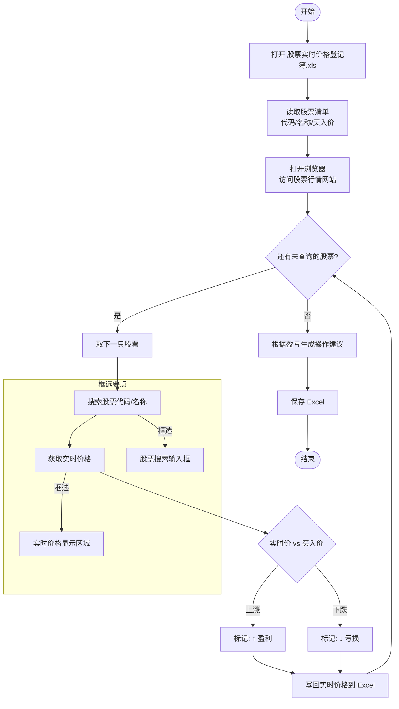

# 股票实时价格采集机器人 - 作业流程图

> 业务流程：启动 → 读取股票清单 → 逐只查询 → 更新价格

```mermaid
graph TD
    Start([开始]) --> OpenExcel[打开 股票实时价格登记簿.xls]
    OpenExcel --> ReadData[读取股票清单<br>代码/名称/买入价]
    ReadData --> OpenBrowser[打开浏览器<br>访问股票行情网站]
    OpenBrowser --> LoopData{还有未查询的股票?}

    LoopData -->|是| GetNext[取下一只股票]
    GetNext --> SearchStock[搜索股票代码/名称]
    SearchStock --> GetPrice[获取实时价格]
    GetPrice --> ComparePrice{实时价 vs 买入价}
    ComparePrice -->|上涨| MarkUp[标记: ↑ 盈利]
    ComparePrice -->|下跌| MarkDown[标记: ↓ 亏损]
    MarkUp --> WritePrice[写回实时价格到 Excel]
    MarkDown --> WritePrice
    WritePrice --> LoopData

    LoopData -->|否| GenerateAdvice[根据盈亏生成操作建议]
    GenerateAdvice --> SaveExcel[保存 Excel]
    SaveExcel --> End([结束])

    subgraph 框选要点
        SearchStock -->|框选| StockSearchBox[股票搜索输入框]
        GetPrice -->|框选| PriceDisplayArea[实时价格显示区域]
    end
```
